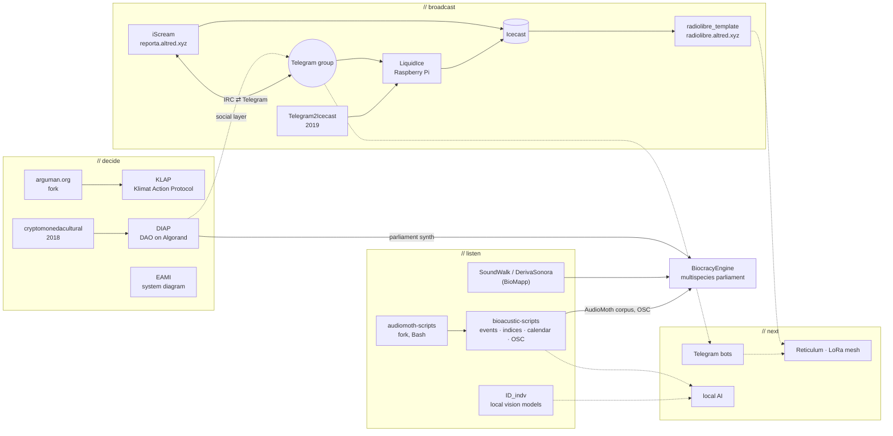

# // projects map

This file shows the repositories under the Permasoftware Assembly. It shows what each repository does, how they connect and where they come from.

Source: github.com/alejoduque, read in October 2026.
Status: **live** = works now :: **active** = work in 2025–2026 :: **prototype** :: **archive** = older work, kept for reference.
Code: **public** = open repository :: **not public yet** = private repository, no link.

---

## // full map



Solid line: data or code goes this way. Dashed line: planned connection.

---

## // listen :: bioacoustics and sensing

| project | what it does | runs on | status | code |
|---|---|---|---|---|
| bioacustic-scripts | Finds sound events in AudioMoth recordings. Calculates acoustic indices (ACI, NDSI, ADI, AEI). Makes clips, a gallery, a seasonal calendar and an OSC stream. | laptop :: Bash, Python, ffmpeg :: no cloud | active | [public](https://github.com/alejoduque/bioacustic-scripts) |
| audiomoth-scripts | Bash scripts for spectrogram images and movies (fork of nwolek). Included in bioacustic-scripts as a submodule. | SoX, ImageMagick, ffmpeg | archive | [public](https://github.com/alejoduque/audiomoth-scripts) |
| SoundWalk / DerivaSonora | Phone app for sound walks. Records sounds with location and tags. Works offline, no account, no tracking. | Android, browser | live | not public yet :: [biomapp.vercel.app](https://biomapp.vercel.app) |
| ID_indv | Compares camera-trap videos to identify individual ocelots. A person makes the final decision. | Apple Silicon laptop :: local models, offline after download | active | [public](https://github.com/alejoduque/ID_indv) |
| BiocracyEngine | Live sound-and-image instrument. Connects a forest sound archive, the Ethereum transaction stream and a multispecies parliament. | laptop :: SuperCollider, Node, Python | active | [public](https://github.com/alejoduque/BiocracyEngine) |

**pipeline :: bioacustic-scripts**

```
WAV (AudioMoth) → spectrogram → event detection (spectral flux) → features + acoustic indices
→ ecological role (rules, 16 types, 4 domains) → clips + media → events.json / OSC / SuperCollider score
→ phenological calendar → gallery.html, report → OSC stream (ports 57120/57121)
```

## // decide :: governance and deliberation

| project | what it does | runs on | status | code |
|---|---|---|---|---|
| KLAP :: Klimat Action Protocol | A group maps its reasons (because / but / however). Each reason gets a weight. The tool shows support and objection for each claim. | one VPS :: Django, Gunicorn, nginx | live | [public](https://github.com/alejoduque/KlimatActionProtocol) :: [klap.altred.xyz](https://klap.altred.xyz) |
| arguman.org | The open-source argument-mapping platform that KLAP comes from. | Django | archive (fork) | [public](https://github.com/alejoduque/arguman.org) |
| DIAP | Design for a community DAO for land governance and restoration. Uses low-energy chains (Algorand, Hedera), test network only. | TypeScript, SuperCollider | prototype | [public](https://github.com/alejoduque/DIAP) |
| cryptomonedacultural | 2018 workshop: a blockchain as a cultural tool, not a financial tool. Origin of the DIAP token idea. | GitBook | archive | [public](https://github.com/alejoduque/cryptomonedacultural) |
| EAMI | Interactive diagram: land use, climate, institutions and AI in one region. | static web app | prototype | not public yet :: [eami.vercel.app](https://eami.vercel.app) |
| ResearchTimeline | Non-linear timeline with calendar import and export, for long research projects. | static web app | live | [public](https://github.com/alejoduque/ResearchTimeline) :: [site](https://research-timeline.vercel.app) |

## // broadcast :: radio and Telegram

| project | what it does | runs on | status | code |
|---|---|---|---|---|
| radiolibre_template | Static player for the Radiolibre streams. Same-origin files only. Stops the download when you pause. | one VPS :: Icecast, nginx | live | [public](https://github.com/alejoduque/radiolibre_template) :: [radiolibre.altred.xyz](https://radiolibre.altred.xyz) |
| iScream | Go on air from a phone browser. No app, no account, no audio recording, no access logs. IRC ⇄ Telegram bridge, public log, live mixer. | Node, ffmpeg, Ergo IRC | live | not public yet :: [reporta.altred.xyz](https://reporta.altred.xyz) |
| LiquidIce | Telegram bot: group media → website archive + radio stream. Copy on archive.org. | Raspberry Pi 3B+ :: Node, Liquidsoap | live | not public yet |
| Telegram2Icecast | First version of the Telegram-to-radio bot. | Raspberry Pi Zero/1 :: Node | archive | [public](https://github.com/alejoduque/Telegram2Icecast) |
| TeleBot | Small Telegram bots for Radiolibre tasks. | Node | prototype | [public](https://github.com/alejoduque/TeleBot) |
| Icecast-Server | Fork of the Icecast streaming server. All radio projects use it. | C | upstream | [public](https://github.com/alejoduque/Icecast-Server) |

---

## // roots :: where the projects come from

```
2009  halfbro ............. IRC bot moves a camera on a live stream        → iScream chat idea
2016  Radio_Pirata ........ FM kits, SDR, Raspberry Pi, "RadioLibre"       → Radiolibre
2016  SDRmde .............. ham radio + SDR study group                   → Reticulum / LoRa interest
2018  AgenteSensores ...... citizen air-quality sensors (un/loquer)        → DataZonificacion
2018  cryptomonedacultural  blockchain as a cultural tool                 → DIAP
2019  TodoEsRadio ......... SDR + community radio workshop (CKWEB)         → Telegram2Icecast
2019  DataZonificacion .... pollution data → sound walk, OSC              → SoundWalk, bioacustic-scripts
2019  Telegram2Icecast .... Telegram → archive + radio                   → LiquidIce
2020  ObservatoriodeloInvisible  open data → OSC → SuperCollider         → bioacustic-scripts (same OSC ports)
2021  LiquidIce ........... Telegram → website + radio on a Raspberry Pi
2025  DIAP, EAMI, ResearchTimeline
2026  KLAP, iScream, BiocracyEngine, SoundWalk 2.x, bioacustic-scripts pipeline, ID_indv
```

## // next :: what the Assembly adds

| layer | today | next |
|---|---|---|
| transport | internet + one small server (VPS, Raspberry Pi) | Reticulum mesh over LoRa, packet radio, Wi-Fi |
| messages | Telegram group + IRC bridge (iScream, LiquidIce) | Telegram + Reticulum (LXMF) bridge |
| intelligence | rules (bioacustic-scripts), local vision models (ID_indv) | small local models on the group's own hardware: speech-to-text for radio archives, summaries of KLAP debates |

Gaps to close:

- Add a licence file to every repository that has none.
- Publish the code of iScream, LiquidIce and SoundWalk when it is ready.
- Use the KLAP instance at klap.altred.xyz for group decisions.
