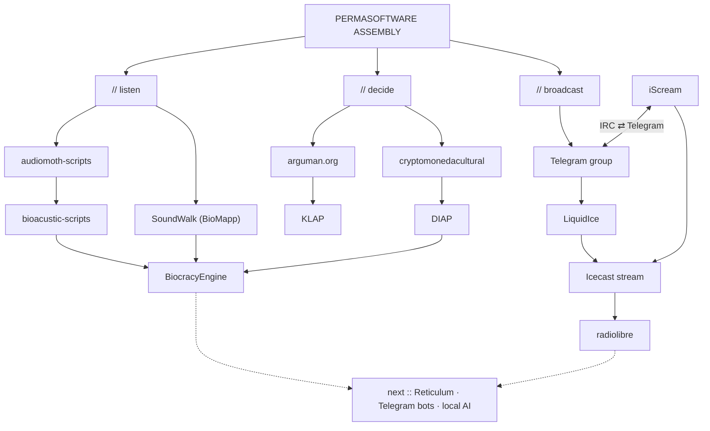

# PERMASOFTWARE ASSEMBLY

**a platform for low-footprint software for climate action and tech sovereignty**

`CCC SWITZERLAND :: SEED GRANTS 2026`

Website: <https://alejoduque.github.io/permasoftware-assembly/> :: [en](index.html) :: [es](es/) :: [fr](fr/) :: [de](de/)

---

## // what

Artist-coders and climate activists make software together. The software helps climate campaigns. It uses little energy and it lasts. The group keeps control of its tools, data and servers.

## // principles

- **Simple.** Use few parts and few dependencies.
- **Durable.** Make tools that work for many years.
- **Energy-light.** Use old hardware and small servers.
- **Repairable.** Publish the code. Write short instructions.
- **Local-first.** Keep the data with the group. Do not track people.
- **Critical AI.** Use AI only when it helps the group. Sometimes the better choice is no AI.

## // map

The full map, with every repository, status and link: [PROJECTS.md](PROJECTS.md).

## // next

- **Reticulum.** Mesh networks over LoRa radio, packet radio, Wi-Fi and the internet. No central server.
- **Telegram.** Bots stay the simple front door. Later, a bridge connects Telegram and Reticulum.
- **Local AI.** Small models on the group's own hardware. No data goes to a cloud.

## // this repository

- Static HTML and one CSS file. No JavaScript, no build step, no external requests, no tracking.
- Each page is about 33 KB, images included. The title is ASCII art; the one image is a 1-bit dithered PNG.
- To edit a page, change the HTML file of that language: `index.html` (en), `es/`, `fr/`, `de/`.
- To see the site on your computer: `python3 -m http.server` and open <http://localhost:8000>.
- GitHub Pages serves the `main` branch from the root folder.

## // people

- **Alejandro Duque Jaramillo** :: coordination, KLAP, Radiolibre.
- **Gonzague Rebetez** :: AI advisor, WÆXE.
- **Creative Climate Changemakers Switzerland 2026** :: seed grant.

To join, open an [issue](https://github.com/alejoduque/permasoftware-assembly/issues). Tell us about your project and your software needs.

## // licence

Text: CC BY-SA 4.0. Code: MIT. See [LICENSE](LICENSE).
